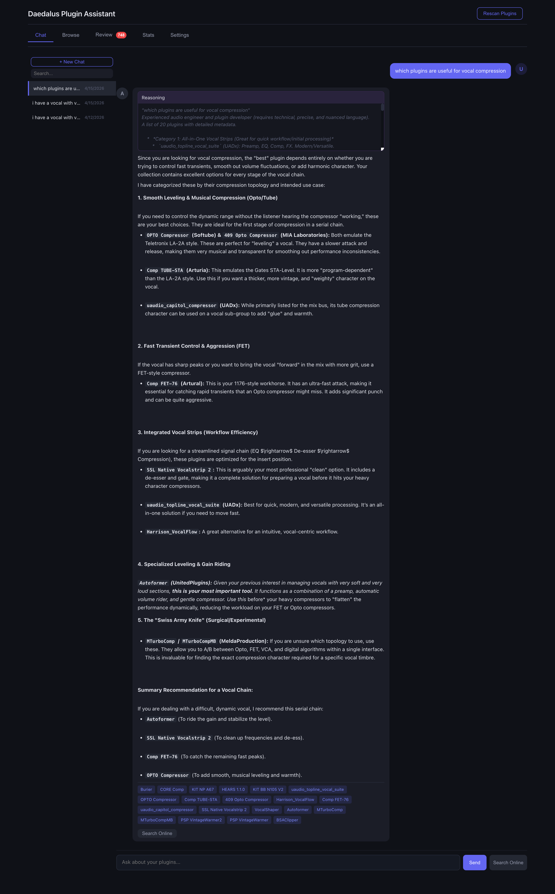
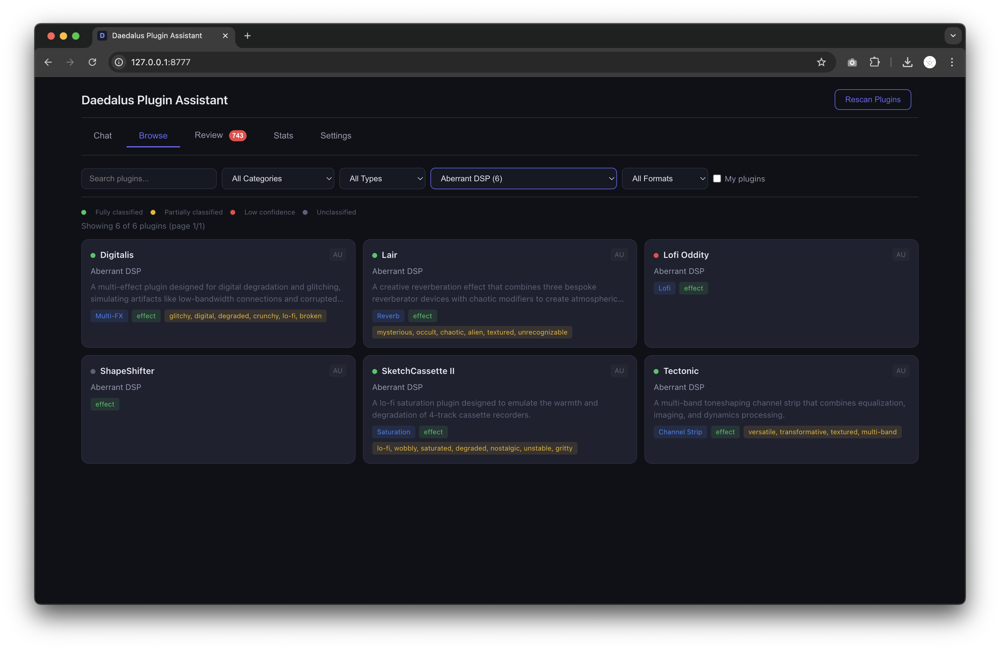
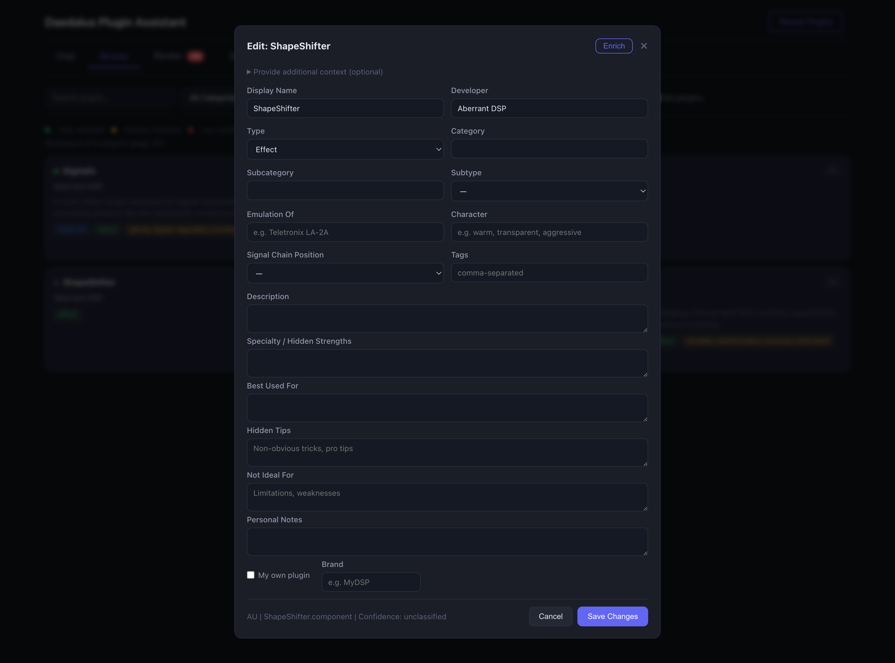
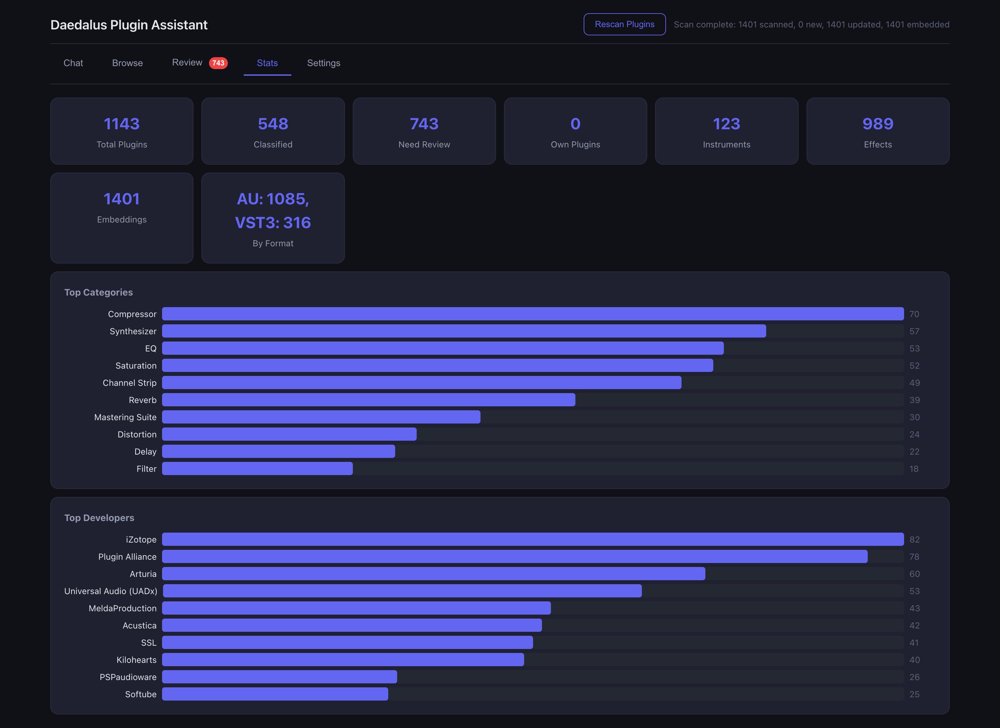
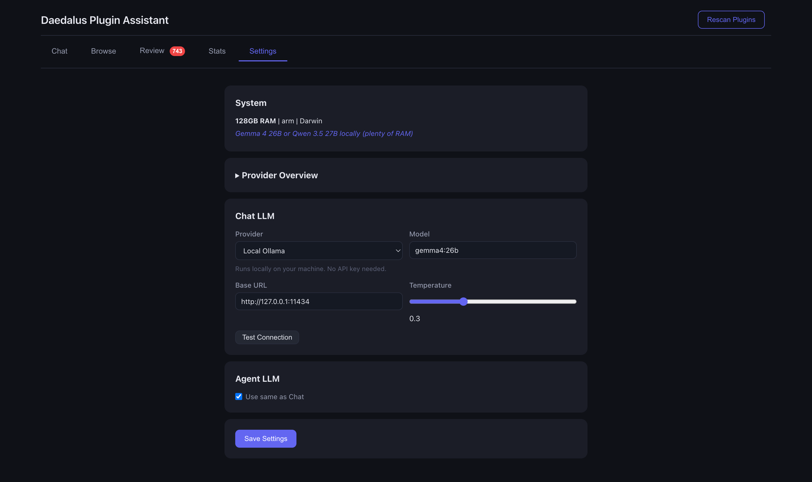
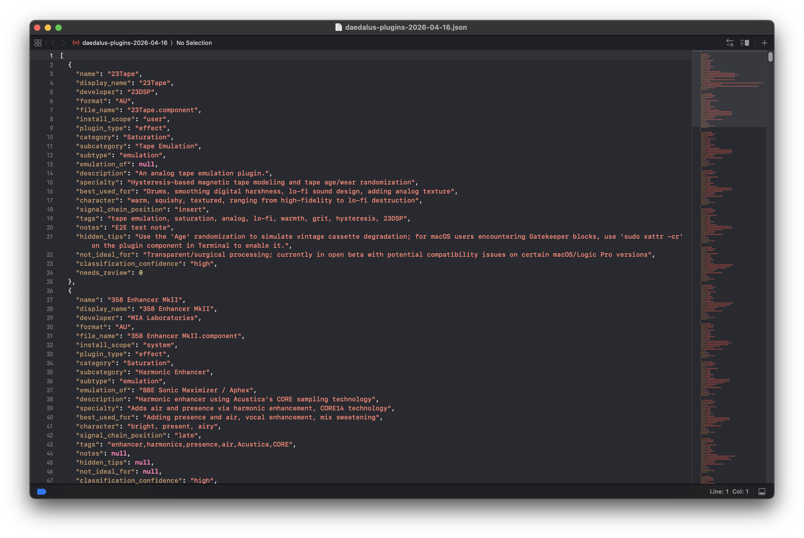
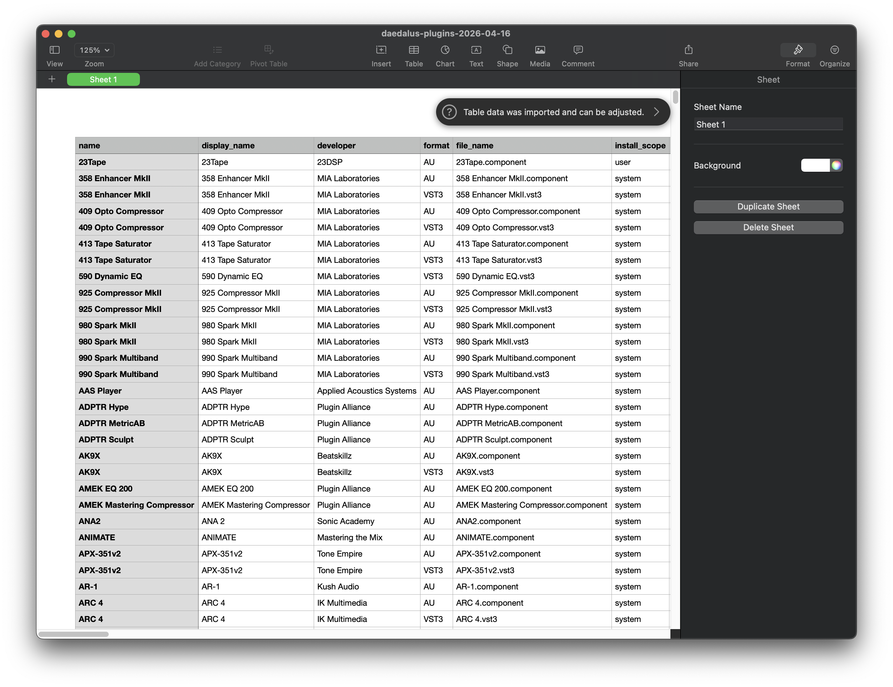

# Daedalus Plugin Assistant

A local macOS application that manages, classifies, and provides intelligent search across your AU and VST3 audio plugin collection using autonomous AI agents and a local LLM via Ollama.







## Features

- **Automatic Plugin Discovery** -- Scans standard macOS plugin directories for AU and VST3 formats
- **Metadata Extraction** -- Reads developer names, plugin types, and display names directly from bundle Info.plist files, with cross-format propagation (AU metadata shared to VST3). Display names come from the developer's own naming, not filename heuristics.
- **Static Classification** -- 1000+ known plugins pre-classified with developer, category, character, and use case data
- **Autonomous AI Enrichment** -- Goal-oriented agents with LLM tool-calling that research plugins autonomously:
  - **Product Info Agent** -- Finds developer, category, description, hardware emulation details from product pages and KVR
  - **Sonic Profile Agent** -- Finds sonic character, use cases, pro tips, and limitations from real user discussions on forums
  - **Quality self-check** -- Agents evaluate their own results and retry with different search strategies if data is thin
- **SearXNG Search** -- Self-hosted metasearch engine (Docker) aggregating Google, Bing, Brave, and DuckDuckGo without rate limits. Falls back to DuckDuckGo if not running.
- **RAG-Powered Chat** -- Ask natural language questions about your plugins with hybrid SQL + semantic search, markdown-rendered responses, and persistent multi-conversation history
- **Search Online in Chat** -- Per-response "Search Online" button to enrich answers with live web results, plus a global search button to query the web directly from the chat input
- **Per-Plugin Enrichment** -- Enrich individual plugins with optional user-provided URLs or PDF manuals
- **Bulk Enrichment** -- Batch-process all unclassified plugins with streaming progress
- **Chat History** -- SQLite-backed multi-conversation history with sidebar, search, and individual delete
- **Browse, Review, Edit** -- Grid-based plugin browser with filters, review queue, and full metadata editor including hidden tips and limitations fields

## Prerequisites

- **macOS** (scans `/Library/Audio/Plug-Ins/` directories)
- **Python 3.10 - 3.13**
- **Ollama** -- local LLM inference -- [ollama.com](https://ollama.com)
- **Docker** -- for SearXNG (optional but recommended) -- [docker.com](https://www.docker.com/products/docker-desktop/)
- **16GB+ RAM** recommended (32GB+ for larger models)

## Quick Start

```bash
# 1. Clone the repo
git clone https://github.com/Mando-369/Daedalus-Plugin-Assistant.git
cd Daedalus-Plugin-Assistant

# 2. Run the app -- handles everything automatically
./run.sh
```

That's it. `run.sh` automatically:
- Finds a compatible Python and sets up a virtual environment
- Installs all dependencies
- Starts Ollama (opens the app if installed)
- Starts SearXNG via Docker (creates the container on first run, restarts it on subsequent runs)
- Frees the server port if something is already using it
- Initializes the database
- Launches the server at [http://127.0.0.1:8777](http://127.0.0.1:8777)

### Manual Setup (if you prefer)

```bash
python3 -m venv .venv
source .venv/bin/activate
pip install -r requirements.txt

# Start Ollama and pull models
ollama serve
ollama pull gemma4:26b
ollama pull nomic-embed-text

# Start SearXNG (optional, runs in a Docker container for clean isolation)
docker run -d --name searxng -p 8888:8080 \
  -e SEARXNG_SECRET=$(openssl rand -hex 32) \
  searxng/searxng

# Start the app
python -m uvicorn src.app:app --host 127.0.0.1 --port 8777
```

### Why SearXNG runs in Docker

SearXNG is a web service that proxies searches to Google, Bing, and others. Docker keeps it cleanly isolated -- no system pollution, no Python conflicts with the app, easy to remove (`docker rm searxng`), and simple to restart. It runs locally; no data leaves your machine beyond the search queries themselves.

### Privacy

Everything runs locally. Ollama runs on your machine, the database is local SQLite, embeddings are computed locally, and SearXNG is a self-hosted search proxy. ChromaDB telemetry is disabled -- no analytics or data collection of any kind.

## Usage

### Scanning Plugins

Click **Rescan Plugins** to discover all installed AU and VST3 plugins. The scanner:
1. Reads plugin directories on disk (configurable in Settings tab)
2. Extracts developer, plugin type, and display names from bundle metadata (Info.plist)
3. Cross-references AU metadata to VST3 versions of the same plugin
4. Runs static classification against 1000+ known plugins
5. Builds vector embeddings for semantic search
6. Detects newly installed plugins and offers to auto-enrich them

### Chat

Ask questions in natural language:
- "What compressor plugins do I have?"
- "I need a warm, vintage-sounding EQ for mastering"
- "Compare my optical compressors"
- "Which plugins emulate the LA-2A?"

The assistant searches your plugin database using hybrid SQL FTS + semantic vector search, then generates a contextual answer with your local LLM. Responses render with full markdown formatting (headers, lists, code, bold). Past user queries are searched for preference context so the assistant remembers your workflow across conversations.

Conversations are saved automatically and accessible from the sidebar. Search past conversations or start a new one anytime. Use **Search Online** to enrich answers with live web results via SearXNG.

### Enrichment

#### Per-Plugin (Edit Modal)
1. Click any plugin to open the edit modal
2. Click **Enrich** to run autonomous research agents
3. Optionally expand "Provide additional context" and paste a URL or PDF path
4. Agents autonomously search the web, fetch product pages, and fill empty metadata
5. If results are thin, agents self-evaluate and retry with different search strategies
6. Review the auto-filled fields and save

#### Bulk (Review Tab)
1. Go to the **Review** tab
2. Set options: delay between plugins (default 2s) and batch limit (auto-pause after N plugins)
3. Click **Enrich with Web Search**
4. Watch the progress bar as agents process each plugin in real-time
5. **Pause/Resume/Cancel** anytime -- auto-pauses on rate limits or batch limits
6. Dismiss individual plugins from the queue with the X button

### Editing & Review

- Click any plugin card to open the full metadata editor
- Edit all fields: developer, category, character, description, hidden tips, limitations, etc.
- Confidence dot turns green automatically when key fields are filled (via enrichment or manual edit)
- Check "My own plugin" for plugins you developed

### LLM Settings

Click the **Settings** tab to configure your LLM backend. A provider comparison table helps you choose:

| Provider | Cost | Privacy | EU/GDPR | Best For |
|----------|------|---------|---------|----------|
| **Local Ollama** | Free | 100% local | N/A | Best quality + privacy (16GB+ RAM) |
| **Euria / Infomaniak** | Free | Swiss-hosted | GDPR compliant | EU users, privacy-focused, no GPU needed |
| **OpenRouter** | Free tier | Cloud | Global | No GPU, no credit card, works everywhere |
| **Google Gemini** | Free tier | Cloud (Google) | Not free in EU | Large context, outside EU only |
| **OpenAI** | Pay-per-use | Cloud | Global | Most reliable, highest quality |
| **DeepSeek** | Very cheap | Cloud (China) | Global | Budget option, strong reasoning |

Default is **Local Ollama**. You can set separate models for chat and enrichment agents (e.g., fast local model for agents, powerful cloud model for chat). Test your connection from the Settings tab before saving.

The Settings tab also lets you configure **scan directories** -- add, remove, or reset the plugin folders that get scanned.

### Export / Import

In the **Settings** tab under **Data Management** you can export and import your plugin database:

- **Export JSON** -- machine-readable format that preserves data types exactly. Best for backup/restore between Daedalus instances since it round-trips perfectly.
- **Export CSV** -- opens in Excel, Numbers, or Google Sheets. Best for browsing your plugin list in a spreadsheet, filtering/sorting manually, or sharing with someone who doesn't use Daedalus.
- **Import** -- upload a previously exported `.json` or `.csv` file. Only updates plugins you already have scanned (matched by filename, format, and scope). Empty fields get filled from the import; existing data is never overwritten.




## Configuration

Key settings in `config.py` (runtime settings are managed via the Settings tab in the UI):

| Setting | Default | Description |
|---------|---------|-------------|
| `OLLAMA_MODEL` | `gemma4:26b` | Default local LLM model |
| `OLLAMA_BASE_URL` | `http://127.0.0.1:11434` | Ollama API endpoint |
| `SEARXNG_URL` | `http://127.0.0.1:8888` | SearXNG instance URL |
| `WEB_PORT` | `8777` | Web server port |
| `PLUGIN_SCAN_DIRS` | Standard macOS paths | Directories to scan for AU, VST3 plugins |
| `EMBEDDING_MODEL` | `nomic-embed-text` | Embedding model (always local via Ollama) |
| `RAG_MAX_CONTEXT_PLUGINS` | `20` | Max plugins included in LLM context |
| `OWN_PLUGIN_BRANDS` | `{}` | Your own plugin brand names for detection |

## Architecture

```
                        Plugin directories on disk
                         (AU, VST3 bundles)
                                  |
                                  v
                         scan_plugins() + plist
                         (developer, plugin_type)
                                  |
                                  v
                    classify_all() (1000+ known plugins)
                                  |
                                  v
                           SQLite Database
                        (your local plugin data)
                          /              \
                         v                v
              Enrichment Agents      RAG Chat Pipeline
                    |                     |
         +─────────+─────────+    hybrid search (SQL + vector)
         |                   |            |
         v                   v            v
  Product Info Agent   Sonic Profile    LLM Generation
  (category, desc,    Agent (character,  (gemma4:26b)
   emulation)          tips, limits)        |
         |                   |              v
         v                   v       Markdown Response
     SearXNG ─────────> fetch_page    + Chat History
  (Google, Bing,        (meta tags,
   Brave, DDG)          JSON-LD)
```

### File Structure

```
src/
  app.py              FastAPI web app + API + WebSocket endpoints
  models.py           SQLite schema + migrations (plugins, conversations, messages)
  scanner.py          Plugin directory scanner + plist metadata extraction
  classifier.py       Static classification database (1000+ plugins)
  embeddings.py       ChromaDB vector store wrapper
  rag.py              RAG pipeline (hybrid search + streaming LLM generation)
  enrichment.py       Legacy enrichment service
  agents/
    base.py           Agent runner (LLM tool-calling loop + quality self-check)
    tools.py          Agent tools (web_search via SearXNG/DDG, fetch_page, read_pdf)
    product_agent.py  Product Info Agent (factual research)
    sonic_agent.py    Sonic Profile Agent (character + forum research)
    orchestrator.py   Enrichment orchestrator (runs agents, merges, applies to DB)

static/
  css/style.css       Dark theme stylesheet
  js/app.js           Frontend (chat, browse, edit, enrichment, conversations)
  favicon.svg         App icon

templates/
  index.html          Single-page app

data/
  plugins.db          SQLite database
  chroma/             ChromaDB vector store

config.py             Central configuration
run.sh                One-command startup (Python, Ollama, SearXNG, server)
```

## Tech Stack

- **Backend**: Python, FastAPI, SQLite, ChromaDB
- **LLM**: Ollama (local inference), gemma4:26b (recommended for tool-calling)
- **Embeddings**: nomic-embed-text via Ollama
- **Search**: SearXNG (self-hosted, Docker) with DuckDuckGo fallback
- **Frontend**: Vanilla JavaScript, CSS (dark theme)
- **Retrieval**: Hybrid SQL FTS5 + cosine-similarity vector search

## Disclaimer

THIS SOFTWARE IS PROVIDED "AS IS", WITHOUT WARRANTY OF ANY KIND, EXPRESS OR IMPLIED, INCLUDING BUT NOT LIMITED TO THE WARRANTIES OF MERCHANTABILITY, FITNESS FOR A PARTICULAR PURPOSE, AND NONINFRINGEMENT.

**The authors and contributors accept no responsibility or liability for:**
- Loss of data, files, or plugin configurations
- Damage to computer systems, audio software, or plugin installations
- Incorrect, incomplete, or misleading metadata generated by AI agents
- Issues arising from third-party services (Ollama, SearXNG, cloud LLM providers)
- Rate limiting, API costs, or account restrictions from external services
- Any consequences of wrong handling, misconfiguration, or misuse of this tool

**AI-generated content:** Plugin metadata, descriptions, and recommendations are produced by large language models and may contain inaccuracies. Always verify critical information independently. The AI may confuse similarly-named products or provide outdated information.

**Web search:** The enrichment agents search the public web via SearXNG or DuckDuckGo. Search results and fetched page content are subject to the terms of service of the respective websites and search engines.

**Use at your own risk.** Back up your data regularly. This is an open-source community project, not a commercial product.

## Acknowledgments

Big thanks to **Hagai Davidoff** for the inspiration behind this project. His [video on organizing and getting the most out of your plugin collection](https://www.youtube.com/watch?v=WkOPXmyh3kg) was the spark that led me to build Daedalus.

## License

GPL v3 -- see [LICENSE](LICENSE)
